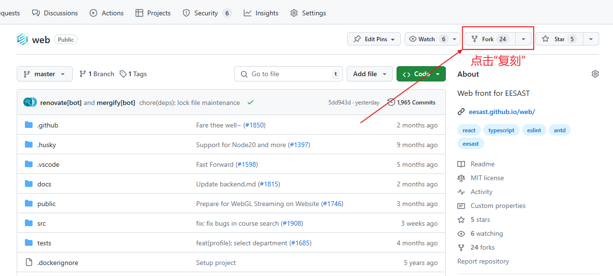
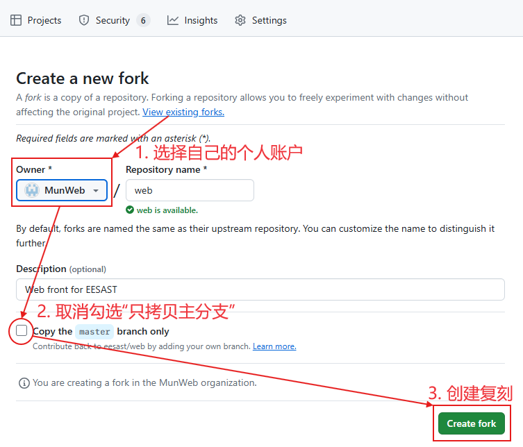
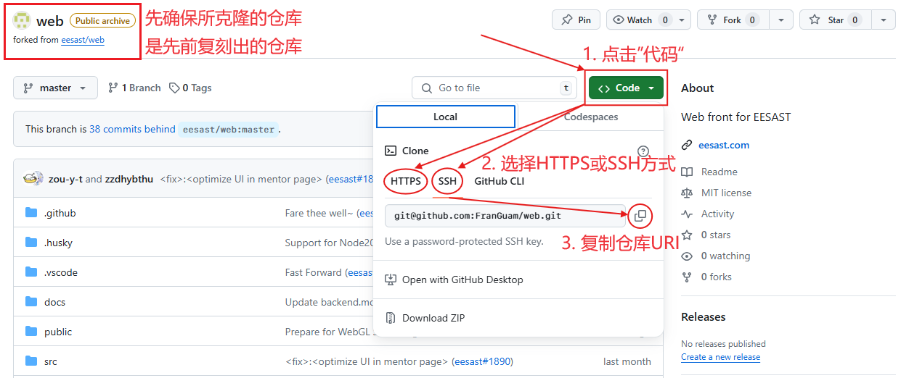

# 科协暑培(网站部分)学习型工程

### 介绍

​ 由于暑培的特性——时间短、覆盖面广、且每人负责一部分，每位主讲人都希望在自己的部分倾囊相授、达到“速成”的效果，因此我们倾向于选择知识密集型的教学方式，或多或少造成了“填鸭式”、“量子波动速读”的效果。一项技术（特别是编程领域）的知识点何其之多，即便主讲人们努力抓住主干脉络，也难免落入长篇累牍堆砌知识点的境地，不仅让听者产生厌烦，也不利于同学们实打实地掌握这门技术。

​ 在反思这种教学方式的弊端过程中，我们打算在今年对暑培的形式做出新的尝试：贯穿始终的学习型工程。在不影响核心知识点的讲解前提下，主讲者们通过演示一个实际工程的搭建过程，来提高同学们对暑培内容的掌握程度。

​ 这个做法有三大好处：

- 由于搭建网站的技术栈有明显地从老到新、从客户端到服务端、从开发到部署的模块结构，我们的培训也是建立在这些模块上分节讲解的，因此可以做到每一讲形成相对独立的演示内容、且逐个模块搭建可以让人更深刻地理解网页技术的架构；
- 每个模块的演示代码都有实际应用情景、组合起来的工程也有设计目标，同学们在搭建过程中会有代码与用途对应的实感、“所写即所得”的获得感，最后亲手完成一个入门工程的成就感，学习兴趣更强；
- 经过设计后，工程中的代码与每一讲的核心知识点对应，能够起到巩固理解的目的，且这些内容也是很多同类生产项目的精简版，能够让同学们切实提高代码能力、提前踩坑、未来上手更复杂的项目更顺畅。

​ 这个学习型工程的主题是**一个趣味会议软件**，希望实现的基本功能有：用户创建和登录、会议创建和加入、会议中倒计时、随机点名等趣味功能，同学们可以把他理解为不含直播的“雨课堂”或“腾讯会议”，也可以理解成一款桌游辅助工具。

​ 以下是各讲对应的演示内容及其在整个工程中的作用：

1. `HTML&CSS`

   HTML、CSS、JS 是网页三大语言，是网页的基础和本质。其中只需 HTML 和 CSS 文件就已经可以构建好看的静态网页了。我们在本节中将“画”出整个应用的首页、主页和“关于这个工程”页，并用简单的素材美化这些页面。在此过程中，我们希望同学们感受到“原来网页就是这么简单的东西“。

2. `JS&TS`

   JS 是让网页动起来的关键，也是一种通用编程语言。这里的”动“不是移动，而是”动态“——不同的情况显示不同的内容。在本节中，我们对之前的页面施加一些魔法，使网页的背景可以随机变化、菜单内容可以展开收缩、表单提交后数据可以保存到文件中以备后用。此外，我们还会介绍 TS——带有类型系统的 JS。

3. `DataBase (SQL&GraphQL)`

   当数据的关系复杂度、规模、并发需求提高到用简单文件保存已不能满足，数据库便应运而生，并成为互联网中最重要的基础设施。在本节中，我们将对用户、会议二个对象和它们之间的关系进行数据库设计和创建（使用 SQL），并使用 Hasura 和 GraphQL 进行数据访存，从而为用户创建和登录、会议创建和加入功能作铺垫。

4. `Backend (NodeJS&Express)`

   在浏览器的操作是受限的、在客户端的身份是可伪造的，因此我们需要在服务器端完成诸如复杂计算、身份验证等功能——即后端。NodeJS 和 Express 是后端的一种实现方式，其中 NodeJS 使 JS 脱离浏览器环境独立运行成为可能。我们在本节中将配合数据库构建完整的用户系统，并探索邮件验证功能。

5. `Frontend (React&Webpack)`

   使用纯 HTML、CSS、JS 搭建网页，我们面临两个挑战：(1) 如果一次只改变部分（但很多）的页面元素，无论是用 JS 改 DOM 树还是重新写一个 HTML 都太费力 (2) 相同的页面元素组合只能复制粘贴，无法简单复用。为此，声明式、组件化的前端框架出现了。在本节中，我们会使用前端框架之一的 React 实现大部分的会议趣味功能，完成所有页面搭建。

6. `Deployment (CI/CD&Server)`

   在前 5 节中，我们已经在本地完成了网站的全部开发工作，但如何让世界上所有人都能 24 小时访问你的网站呢？在本节，我们将运用 Github CI/CD 来构建前端和后端的 Docker 镜像，使用 Github Pages 来托管前端页面，并尝试自己购买一个云服务器来提供网站的后端和数据库服务。

### 使用方法

##### 复刻仓库（Fork Repo）

这个仓库隶属于 EESAST 组织，并关闭了直接提交的权限。要对代码进行修改，需要在你自己的个人账户中复刻这个仓库（本质是两个仓库，不同姓也可以不同名，但有天然的关联）。



---



##### 克隆仓库（Clone Repo）

复刻后的仓库只储存在 Github 云端。为了更方便地修改、测试代码，需要克隆到本地电脑上（本质也是两个仓库，不要求同姓或同名，但有天然的关联）。

在克隆之前，请确保：

- 在电脑中找到/创建一个供存放仓库的文件夹，空间建议至少 2G，路径尽量不要有中文，**切勿选择清华云盘等网络位置！**
- 电脑上已安装 Git，并配置了用户名和邮箱。
- 如使用 SSH Clone（推荐），则要在 Github 官网上上传 RSA 公钥，并做适当的网络配置（详见暑培 Git 部分）。



在本地文件夹中，用任意终端（可右键打开）运行

```bash
git clone <先前复制的仓库URI>
```

克隆应当在几秒内完成，并在当前文件夹中创建一个名为`web-workshop`的子文件夹（即本工程）。

若出现网络问题，请自行根据现象/报错搜索解决方案，也可在暑培群中反馈。

##### 仓库结构

简要介绍仓库内的主要文件夹：

- `./github/workflows`：Github CI/CD 的配置文件，在 Deployment 一节中会用到
- `/assets`：说明文档中插入的图片素材，无需关心
- `/backend`：后端代码存放位置，Backend 一节中会用到
- `/database`：数据库相关代码存放位置，Database 一节中会用到
- `/frontend`：前端代码存放位置，HTML&CSS、JS&TS、Frontend 三节中会用到
- `/server`：部署云服务相关配置文件，在 Deployment 一节中会用到
- `/tutorials`：**每一节演示内容和作业的说明**，以及授课的讲义

##### 学习方式（对每节演示内容都重复以下步骤）

> 注：以下 git 指令都可以使用 vscode 图形化界面操作替代，有需要的请自行摸索

1. 切换到本节演示内容对应的分支（本地只有主分支是正常的，请在 Github 云端仓库查看所需的分支名）

   ```bash
   git checkout "<branch-name>"
   ```

2. 请先阅读`/tutorials/<branch-name>.md`，确保你已经正确地配置了环境

3. 分支上已有了一些提交，每个提交都对应新增的功能，你可以在`/tutorials/<branch-name>.md`中找到说明。若要查看运行每次提交的修改内容和实际效果，请找到提交对应的 Hash 值并运行以下命令

   ```bash
   git checkout <commit-hash>
   ```

4. 在你对代码做任何修改前，请确保你已经切换回到分支的最新提交

   ```bash
   git checkout "<branch-name>"
   ```

5. 你可以根据`/tutorials/<branch-name>.md`中的作业要求编码代码，或自由地修改对应代码来探索效果

6. 在修改完成后，记得保存并提交你的修改，建议使用规范化地提交命名

   ```bash
   git add <files>
   git commit -m "<commit-message>"
   ```

7. 为了与之前几节中你的修改内容配合起来，需要将新增的提交合并到主分支

   ```bash
   git checkout main
   git rebase "<branch-name>"
   ```

8. 为了其他人能看到你的提交，请同步到 Github 云端仓库（克隆前的）

   ```bash
   git push --all
   ```
