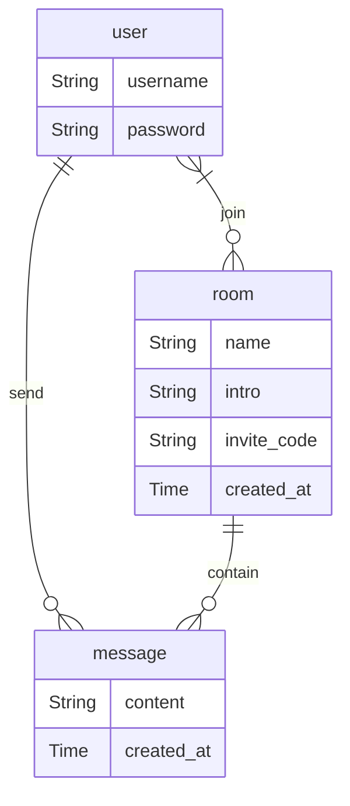

# 数据库设计

> 至少一半的屎山，来源于烂的数据库设计

### 步骤

1. 需求分析
2. 概要设计（E-R 图）
3. 表和字段设计

### 1. 分析需求

_所有涉及到数据在多人、多终端之间共享、同步的功能，都要用到数据库。_

以下是本工程希望实现的基本功能

- 用户注册、登录
- 会议创建、加入
- 会议中的聊天室

### 2.1 标识实体（Entity）

_需求中的所有“不可分拆物”，及它们的属性。_

- 用户（用户名、密码）
- 会议（名称、介绍、邀请码、创建时间）
- 消息（消息体，创建时间）

### 2.2 标识关系（Relation）

_与两个或多个实体有关系的信息。_

- 用户加入会议（用户——会议）
- 用户在会议中发出消息（用户——会议——消息，可分拆为 用户——消息 + 会议——消息）

### 2.3 E-R 图

### 3.0 设计范式

- 第一范式：要求数据库的每一列都是不可分割的原子数据项
- 第二范式：要求表中每一列都和主键相关，而不能只与主键的某一部分相关（每张表只描述一件事）
- 第三范式：要求表中每一列数据和主键直接相关，而不能间接相关

### 3.1 设计表

_一般来说，一个实体对应一张表，多对多的关系也可对应一张表。_

| 表        | 字段        | 数据类型  | 主键 | 外键      |
| --------- | ----------- | --------- | ---- | --------- |
| user      | uuid        | uuid      | 是   |           |
|           | username    | text      |      |           |
|           | password    | text      |      |           |
| room      | uuid        | uuid      | 是   |           |
|           | name        | text      |      |           |
|           | intro       | text      |      |           |
|           | invite_code | text      |      |           |
|           | created_at  | timestamp |      |           |
| user_room | user_uuid   | uuid      | 是   | user.uuid |
|           | room_uuid   | uuid      | 是   | room.uuid |
| message   | uuid        | uuid      | 是   |           |
|           | user_uuid   | uuid      |      | user.uuid |
|           | room_uuid   | uuid      |      | room.uuid |
|           | content     | text      |      |           |
|           | created_at  | timestamp |      |           |

注：由于使用的是 PostgreSQL，其`text`类型指长度可变的字符串，与其他数据库可能不同（[PostgreSQL: Documentation: 16: Chapter 8. Data Types](https://www.postgresql.org/docs/current/datatype.html)）
